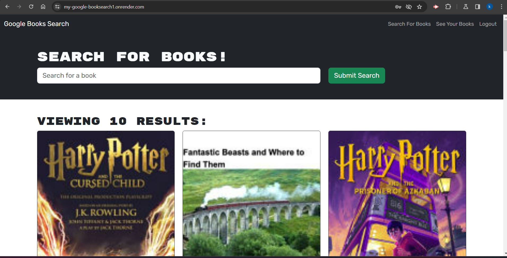
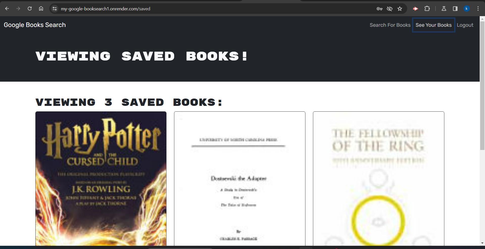

# Google-book-search

 
  

## Description
📙 This is a Book search App using Google API. User can signup/sign in, Search books and add/remove them from favourites. 

## Table of Contents
- [Description](#description)
- [Installation](#installation)
- [Usage](#usage)
- [License](#license)
- [Contributing](#contributing)

## Installation

If running localy:

⚙️ Clone Repo

⚙️ Npm I

⚙️ Npm run develop

## Usage

💻 Deployed URL:

https://my-google-booksearch1.onrender.com/

## Mock-up

Saved books:

 

## License

 

This application is covered by the MIT license. 

## Contributing

Used mini project as reference
